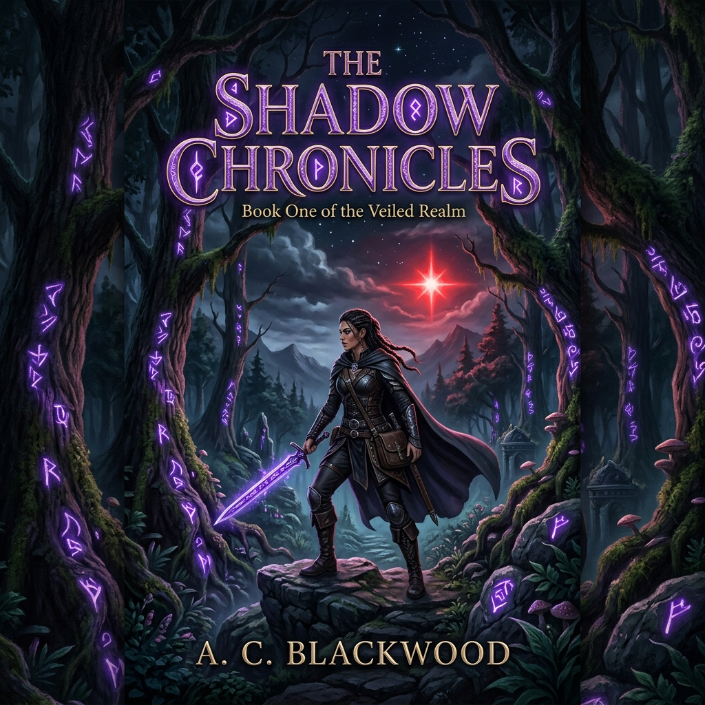

# 📖 Kindle Novel Reader PWA (แอปอ่านนิยายสไตล์ Kindle)

ยินดีต้อนรับสู่ **Kindle Novel Reader**! แอปพลิเคชันอ่านนิยายแบบ PWA (Progressive Web App) ที่ออกแบบมาให้มีหน้าตาและการใช้งานที่เรียบง่าย สบายตา และมีฟีเจอร์ปรับแต่งหลากหลายเสมือนอ่านบนเครื่อง Kindle รองรับการอ่านแบบออฟไลน์ และสามารถใช้งานบนเว็บหรือติดตั้งลงบนโทรศัพท์มือถือ/คอมพิวเตอร์ของคุณได้โดยตรง

---

## 🚀 แนะนำการใช้งานเบื้องต้น (User Guide)

1. **การเข้าใช้งานแอปพลิเคชัน**:
   - เปิดลิงก์เว็บแอปพลิเคชันผ่านบราวเซอร์ของคุณ (เช่น Google Chrome, Safari หรือ Edge)
   - หน้าแรกจะแสดง **ชั้นหนังสือ (Bookshelf)** ที่มีรายชื่อนิยายทั้งหมดพร้อมหน้าปกและจำนวนตอน

2. **การติดตั้งแอป (PWA)**:
   - หากใช้งานบน Google Chrome หรือ Safari คุณสามารถกดปุ่ม **"เพิ่มไปยังหน้าจอหลัก" (Add to Home Screen)** หรือกดไอคอนรูปคอมพิวเตอร์/เครื่องหมายบวกที่แถบที่อยู่เว็บเพื่อติดตั้งแอปพลิเคชันลงบนเครื่องได้ทันที ซึ่งจะทำให้อ่านนิยายได้รวดเร็วขึ้นและรองรับการใช้งานออฟไลน์

3. **การอ่านนิยาย**:
   - คลิกที่ปกนิยายเรื่องที่ต้องการอ่านจากชั้นหนังสือ
   - ระบบจะเปิดตอนล่าสุดที่คุณอ่านค้างไว้ หรือตอนแรกสุดโดยอัตนัย

4. **การปรับแต่งแถบควบคุมการอ่าน (Customization Menu)**:
   - คลิก/แตะที่แถบเมนูด้านบนหรือบริเวณกึ่งกลางหน้าจอขณะอ่านเพื่อเปิดเมนูตั้งค่า
   - **ธีมการอ่าน (Themes)**: เลือกโทนสีที่ต้องการ เช่น กระดาษขาว (Light Paper), ถนอมสายตา (Warm Sepia), เขียวพาสเทล (Sage Mint Green), เทาหนังสือพิมพ์ (Muted Newsprint), หรือจอมืด (OLED Black)
   - **แบบอักษร (Fonts)**: สลับระหว่างแบบอักษรมีหัว (Serif - Lora/Merriweather) หรือไม่มีหัว (Sans-serif - Sarabun/Inter)
   - **ขนาดอักษร (Font Size)**: ปรับขนาดตัวอักษรได้ 6 ระดับ
   - **ความกว้างของหน้าจอ (Layout Width)**: ปรับระยะขอบข้อความได้ 3 ระดับ
   - **ระยะห่างระหว่างบรรทัด (Line Height)**: ปรับความโปร่งของย่อหน้าได้ 3 ระดับ

5. **เมนูสารบัญและการจดจำตำแหน่งอ่านค้าง**:
   - กดปุ่มไอคอนสารบัญด้านบนเพื่อเลือกบทเรียนหรือตอนต่างๆ
   - แอปจะจดจำบทที่อ่านล่าสุดและตำแหน่งที่เลื่อนค้างไว้โดยอัตโนมัติ เมื่อเปิดเข้ามาใหม่จะเริ่มอ่านต่อได้ทันที

---

## 📚 รายชื่อนิยายในระบบ (Novels List)

นี่คือรายชื่อนิยายทั้งหมดที่มีอยู่ในระบบปัจจุบันพร้อมภาพปกและจำนวนตอน:

| หน้าปก (Cover) | ชื่อนิยาย (Title) | รายละเอียดเบื้องต้น (Description) | จำนวนตอน (Chapters) |
| :---: | :--- | :--- | :---: |
|  | **BOF1 Novel** | นิยายผจญภัยสุดคลาสสิกของนักรบแห่งเผ่ามังกรขาวในการกอบกู้โลกจากจักรวรรดิมังกรดำ | 30 ตอน |
|  | **Bof2 Novel** | ตำนานบทใหม่ของเด็กหนุ่มผู้ถูกโลกหลงลืมและชะตากรรมที่ต้องเผชิญหน้ากับความศรัทธาที่บิดเบี้ยว | 28 ตอน |
|  | **BOF3 Part 1** | การเดินทางของริว เด็กหนุ่มผู้สืบทอดพลังมังกรโบราณในครึ่งแรกของการเดินทางแสวงหาความจริง | 44 ตอน |
|  | **BOF3 Part 2** | บทสรุปการผจญภัยของริวและพรรคพวกเพื่อเผชิญหน้ากับพระผู้สร้างและค้นหาความหมายของชีวิต | 24 ตอน |
|  | **DWM2 Novel** | การเดินทางทะลุมิติของเด็กหญิงและเด็กชายผู้เป็นผู้ฝึกมอนสเตอร์เพื่อปกป้องเกาะบ้านเกิดของตน | 20 ตอน |
|  | **FF1 Novel** | มหากาพย์นักรบแห่งแสงทั้งสี่กับการทำลายลูปเวลา 2,000 ปีเพื่อช่วยเหลืออาณาจักรคอร์เนเลีย | 45 ตอน |
|  | **Goemon 3 Novel** | การผจญภัยข้ามเวลาสุดป่วนของโกเอมอนนินจาจอมกะล่อนและหุ่นยักษ์อิมแพคในยุคนีโอเอโดะ | 48 ตอน |
|  | **The Shadow Chronicles** | An epic fantasy story of light and dark forces battling for control of the ancient kingdom of Eldoria. | 2 ตอน |

---

## 🛠️ วิธีการเพิ่มนิยายเรื่องใหม่ (For Developers)

หากต้องการเพิ่มนิยายเข้าไปในระบบ:
1. สร้างโฟลเดอร์นิยายใหม่ไว้ภายใต้ `novels/` (เช่น `novels/My-New-Novel`)
2. ใส่ตอนของนิยายในรูปแบบไฟล์ Markdown (`.md`) โดยตั้งชื่อเรียงตามลำดับ เช่น `Chapter_1.md`, `Chapter_2.md`
3. วางภาพหน้าปกในโฟลเดอร์ โดยตั้งชื่อไฟล์เป็น `cover.png` หรือภาพประเภทอื่น เช่น `.jpg`
4. (ตัวเลือกเสริม) เพิ่มไฟล์ `metadata.json` ในโฟลเดอร์เพื่อกำหนดชื่อเรื่อง ผู้เขียน และคำอธิบายนิยาย:
   ```json
   {
     "title": "ชื่อนิยายของคุณ",
     "author": "ชื่อผู้แต่ง",
     "description": "คำอธิบายหรือเนื้อเรื่องย่อ"
   }
   ```
5. รันคำสั่งคอมไพล์ดัชนีด้วยคำสั่ง `node generate-index.js` หรือทำการ Commit และ Push ไปยัง GitHub เพื่อให้ GitHub Actions รันคอมไพล์และอัปเดตเว็บให้อัตโนมัติ!
